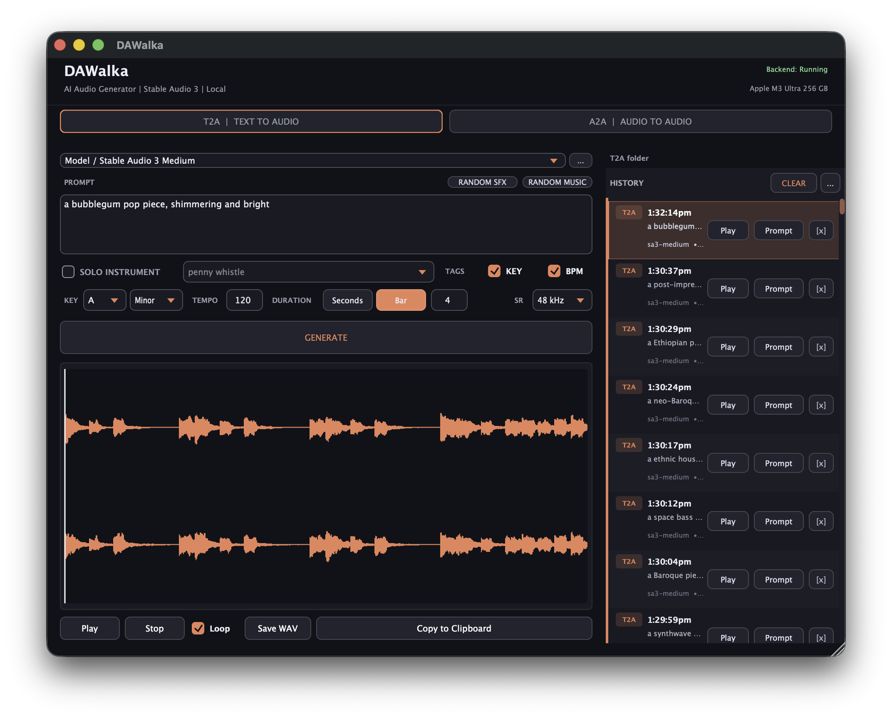

# DAWalka

**AI Audio Generator for DAWs** — an AU/VST3 plugin that generates
music loops, instrument phrases, textures, and sound effects with
**Stable Audio 3**, fully on-device, inside your DAW project.

Two modes:

* **T2A (Text-to-Audio)** — generate from a text prompt.
* **A2A (Audio-to-Audio)** — re-style an existing audio file in the
  style of the prompt, at the same duration. Supports WAV, AIFF, FLAC
  and OGG input.

Key features:

* 100% local — no cloud calls after the first model download.
* Hardware-accelerated on Apple Silicon (MLX → Metal).
* Generation runs in a separate process — your DAW never blocks.
* Project BPM and timeline duration are picked up automatically.
* Drag-and-drop the result straight onto a host track.

Latest version and source:

**https://github.com/pcixmix/DAWalka**

---

## System requirements

| | Recommended |
|---|---|
| macOS | 14 Sonoma or newer |
| Mac | Apple Silicon M-series (M1 / M2 / M3 / M4 / M5) |
| RAM | 16 GB+ |
| Free disk | 10 GB for the plugin, venv, and all model weights |

Models and the Python runtime together need ~10 GB of disk on first
install. The plugin itself is only ~11 MB.

---

## Install

Double-click `DAWalka.app` and click **✕ Install**. The installer will:

1. Create a self-contained Python virtual environment.
2. Install MLX, sentencepiece, aiohttp, numpy, soundfile, scipy,
   huggingface_hub.
3. Download the Stable Audio 3 model weights (~6.7 GB total) into a
   per-user cache.
4. Copy the pre-built AU and VST3 plugins into your user plug-in folders.
5. Verify the AU with `auval` and check that the VST3 bundle is complete.

The installer is safe to re-run — every step is a no-op if its
artefact is already in place.

---

## Where things go

| What | Path |
|---|---|
| Audio Unit plugin | `~/Library/Audio/Plug-Ins/Components/DAWalka.component` |
| VST3 plugin | `~/Library/Audio/Plug-Ins/VST3/DAWalka.vst3` |
| Python venv | `~/Library/Application Support/DAWalka/venv` |
| Model weights | `~/Library/Application Support/DAWalka/models` |
| Settings | `~/Library/Application Support/DAWalka.settings` |
| Generated audio (T2A) | `~/Documents/DAWalka/T2A` |
| Generated audio (A2A) | `~/Documents/DAWalka/A2A` |
| Backend log | `~/Library/Application Support/DAWalka/backend.log` |

The T2A and A2A folders are created automatically. You can also drop
your own audio into `~/Documents/DAWalka/T2A/` and pick it up as A2A
input directly from the plugin.

---

## Models

The plugin ships with three Stable Audio 3 variants (all from the
open `stabilityai/stable-audio-3-optimized` repository, pure-MLX
weights — no PyTorch required):

* `sa3-sm-music` — small model, music (recommended for everyday use).
* `sa3-sm-sfx`   — small model, sound effects.
* `sa3-medium`   — medium model, higher quality, slower.

SAME encoders (used only for A2A) are downloaded lazily on the first
A2A request.

---

## Uninstall

Open `DAWalka.app` and click **✕ Uninstall**. The uninstaller
removes the AU/VST3 plugins, the Python venv, the model weights, and the
plugin's settings. Your generated audio in `~/Documents/DAWalka/`
is always kept — to delete it, remove the folder manually.

---

## Library dependencies

The Python backend (runs in its own process, separate from the
plugin) uses:

* **MLX** + **mlx-metal** — Apple Silicon GPU acceleration.
* **aiohttp** — async HTTP server (`127.0.0.1:47823`) for the plugin
  to talk to the model.
* **numpy**, **soundfile**, **scipy** — audio I/O and processing.
* **sentencepiece** — tokenizer.
* **huggingface_hub** — model downloads (anonymous by default;
  optional `HF_TOKEN` env var raises the daily rate limit).
* **stabilityai/stable-audio-3-optimized** — open-source MLX weights.

The plugin UI itself is built with **JUCE 8** (C++20, AUv2, VST3, Metal).

---

## Using the plugin

1. Open any AU/VST3-compatible DAW (Logic, Ableton, Reaper, Bitwig, etc.).
2. Create an instrument/generator track.
3. Pick `DAWalka` from the AU or VST3 plug-in list.
4. Choose a model, type a prompt, press **Generate**.
5. Drag the resulting waveform straight onto a host track.

In **A2A** mode the same UI gains an INPUT browser (left panel) and
an OUTPUT history (right panel). Drop a WAV / AIFF / FLAC / OGG file
into the input browser — files copy, they don't move.

For full troubleshooting tips and the dev documentation, see the
project page on GitHub:

**https://github.com/pcixmix/DAWalka**

## Support

If you find this project useful, consider supporting its continued development with a subscription. Your contribution helps fund ongoing improvements, maintenance, and future updates while keeping the plugin completely free and open-source.

**https://boosty.to/pcixmix**
